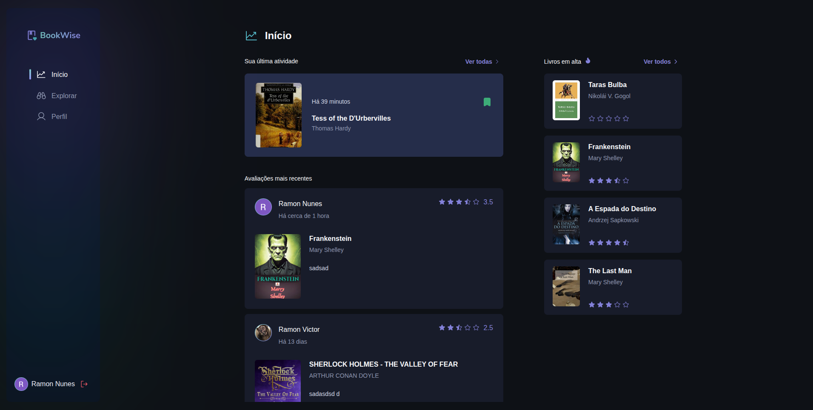
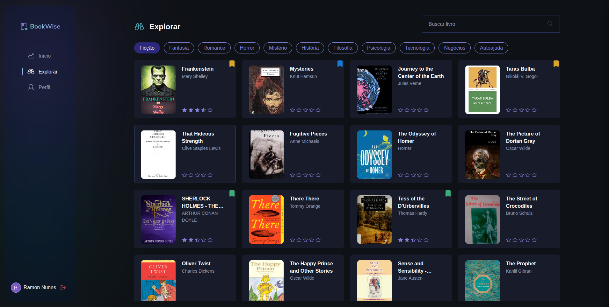
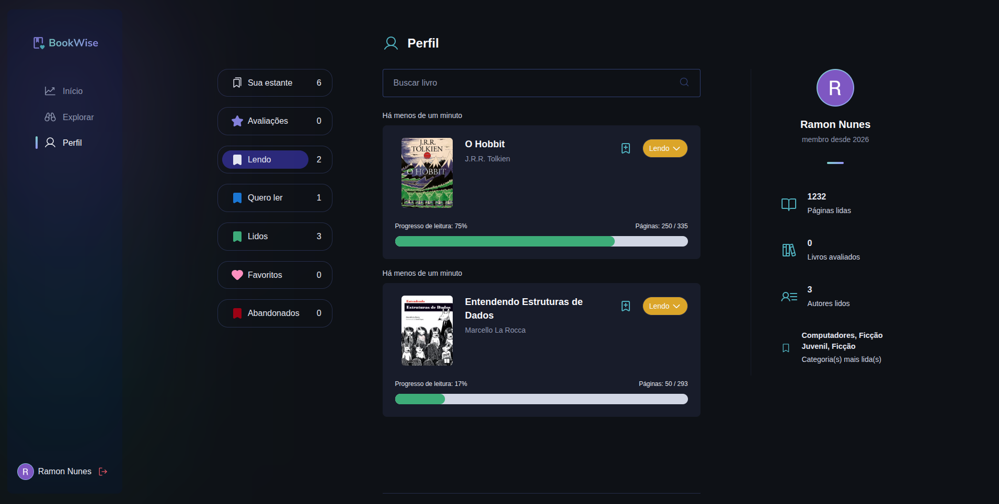
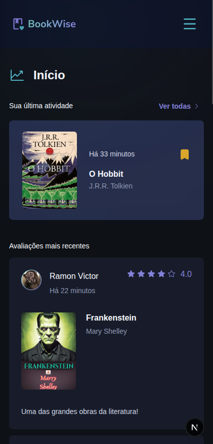
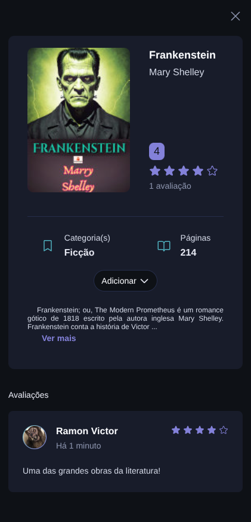

# 📚 BookWise

BookWise é uma plataforma moderna para leitores descobrirem, organizarem e avaliarem livros.  
Os usuários podem criar conta, montar sua biblioteca pessoal, acompanhar progresso de leitura e interagir com avaliações da comunidade.

## 🌐 Acesse o projeto

🔗 https://book-wise-ruddy.vercel.app/

---

## ✨ Funcionalidades

### 👤 Autenticação

- Login com Google
- Login com GitHub
- Sessão segura com NextAuth

### 📚 Biblioteca pessoal

- Adicionar livros à estante
- Alterar status:
  - Quero ler
  - Lendo
  - Lido
  - Abandonado
- Atualizar progresso de leitura
- Adicionar livros à lista de favoritos
- Reordenar livros

### 🔎 Exploração de livros

- Buscar livros por título
- Navegar por categorias
- Descobrir novos livros

### ⭐ Avaliações

- Avaliar livros
- Visualizar avaliações de outros usuários
- Histórico de reviews

### 👥 Social

- Ver perfil de outros usuários

### 📱 Responsividade

- Interface adaptada para desktop e mobile

---

## 📸 Screenshots

### Início

### Explorar

### Perfil

### Mobile

---

---

## 🛠️ Tecnologias Utilizadas

### Front-end

- Next.js 15
- React 19
- TypeScript
- Stitches
- Radix UI
- dnd kit
- Lucide React

### Back-end / Infra

- Next.js API Routes
- Prisma ORM
- PostgreSQL
- NextAuth

### Estado / Performance

- TanStack Query
- Intersection Observer

### Formulários / Validação

- React Hook Form
- Zod

### APIs consumidas
- Google Books API
---

## 🎯 Objetivo do Projeto

O BookWise foi criado para oferecer uma experiência moderna para leitores organizarem sua jornada literária, descobrirem novos livros e compartilharem opiniões com outros usuários.

Além disso, o projeto também teve como foco o aprofundamento em tecnologias modernas de desenvolvimento fullstack, autenticação OAuth, modelagem de banco de dados e construção de interfaces performáticas e responsivas.

---

## 💡 Aprendizados

Durante o desenvolvimento deste projeto foram aprofundados conhecimentos em:

- Arquitetura com Next.js
- Prisma + banco relacional
- Consumo de APIs externas
- OAuth com Google e GitHub
- Gerenciamento de cache com React Query
- Interfaces escaláveis com Stitches
- UX responsiva para múltiplos dispositivos

---

## 👨‍💻 Autor

Desenvolvido por **Ramon Victor Barros Nunes**

- GitHub: https://github.com/RamonVBN
- LinkedIn: https://linkedin.com/in/ramon-barros-4a107837a
